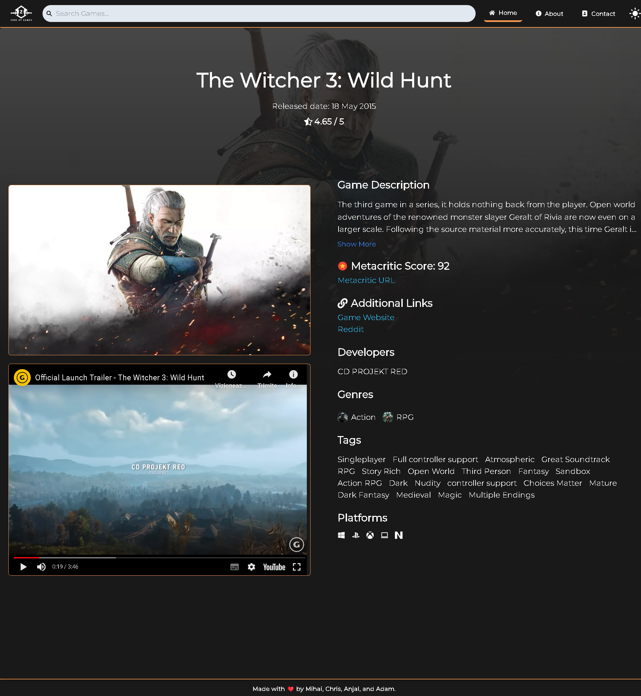
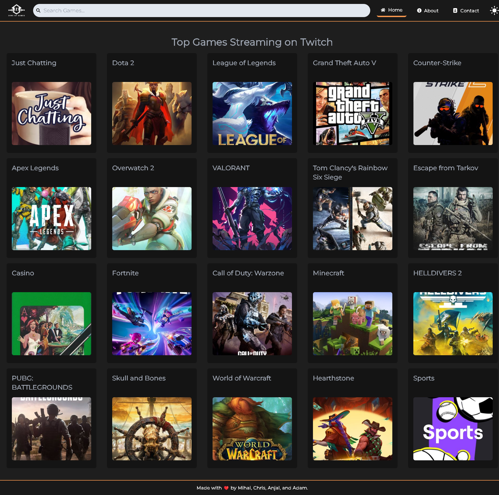

<div align="center">
<h1 align="center">

<br>ZONE-OF-GAMES</h1>
<h3>◦ Unleash your gaming prowess in the Zone!</h3>
<h3>◦ Developed with the software and tools below.</h3>

<p align="center">


</p>


</div>

---

## 📖 Table of Contents

-  [📖 Table of Contents](#-table-of-contents)
-  [📍 Overview](#-overview)
-  [📦 Features](#-features)
-  [📂 Repository Structure](#-repository-structure)
-  [⚙️ Modules](#%EF%B8%8F-modules)
-  [🚀 Getting Started](#-getting-started)
   -  [🔧 Installation](#-installation)
   -  [🤖 Running Zone of Games](#-running-zone-of-games)
   -  [🌐 Live Demo Zone of Games](#-live-demo-zone-of-games)
   -  [📸 Screenshot Zone of Games](#-screenshot-zone-of-games)
-  [🛣 Roadmap](#-roadmap)
-  [🤝 Contributing](#-contributing)
-  [📄 License](#-license)
-  [👏 Acknowledgments](#-acknowledgments)

---

## 📍 Overview

Zone of Games is a gaming-centric platform that caters to enthusiasts seeking a comprehensive gaming experience. The project's primary focus is on providing detailed information about specific games alongside live gaming streams sourced from Twitch, all conveniently accessible on a per-game basis.

## 

## 📦 Features

### Game Information Page

|     | Feature                   | Description                                                                                                                          |
| --- | ------------------------- | ------------------------------------------------------------------------------------------------------------------------------------ |
|     | **Dedicated Pages**       | Each game has its dedicated page, easily accessible from the homepage or search results.                                             |
|     | **Comprehensive Details** | Game pages include essential information such as release date, developer details, trailers, scores, screenshots, and twitch streams. |

### Live Streams Section

|     | Feature             | Description                                                                                                                             |
| --- | ------------------- | --------------------------------------------------------------------------------------------------------------------------------------- |
|     | **Dynamic Updates** | At the bottom of each game page, a dedicated section display live gaming streams from Twitch related to the specific game being viewed. |
|     | **Relevance**       | Ensures that the Twitch streams presented are relevant and engaging for users interested in a particular game.                          |

### User-friendly Navigation

|     | Feature              | Description                                                                                                                          |
| --- | -------------------- | ------------------------------------------------------------------------------------------------------------------------------------ |
|     | **Intuitive Design** | The website is user-friendly navigation, enabling smooth transitions between game pages and easy access to the live streams section. |

### Responsive Design

|     | Feature                   | Description                                                                                                              |
| --- | ------------------------- | ------------------------------------------------------------------------------------------------------------------------ |
|     | **Consistent Experience** | The website boasts a responsive design, ensuring a consistent and enjoyable user experience across a variety of devices. |

---

## 📂 Repository Structure

```sh
└── zone-of-games/
    ├── .eslintrc.cjs
    ├── .github/
    │   └── workflows/
    │       └── publish.yml
    ├── index.html
    ├── package-lock.json
    ├── package.json
    ├── postcss.config.js
    ├── public/
    ├── src/
    │   ├── App.jsx
    │   ├── components/
    │   │   ├── CollapsibleSection.jsx
    │   │   ├── Footer.jsx
    │   │   ├── GameBanner.jsx
    │   │   ├── GamesByGenre.jsx
    │   │   ├── GamesByPlatform.jsx
    │   │   ├── Header.jsx
    │   │   ├── Loading.jsx
    │   │   ├── MainContent.jsx
    │   │   ├── PageLayout.jsx
    │   │   ├── RawgGenreList.jsx
    │   │   ├── RawgPlatformList.jsx
    │   │   ├── RawgTopRatedGames.jsx
    │   │   ├── TwitchTopGames.jsx
    │   │   └── TwitchTopStreams.jsx
    │   ├── context/
    │   │   └── ThemeContext.jsx
    │   ├── index.css
    │   ├── main.jsx
    │   ├── pages/
    │   │   ├── 404.jsx
    │   │   ├── About.jsx
    │   │   ├── Contact.jsx
    │   │   ├── games/
    │   │   ├── Home.jsx
    │   │   └── streams/
    │   └── services/
    │       ├── rawgApi.jsx
    │       ├── twitchApi.jsx
    │       └── youtubeAPI.jsx
    ├── tailwind.config.js
    └── vite.config.js

```

---

## ⚙️ Modules

<details open><summary>Root</summary>

| File                                                                                                                   | Summary                                                                                                                                                                                                                                                                                                                                                                                                                                                                                                                                                                                                                                                |
| ---------------------------------------------------------------------------------------------------------------------- | ------------------------------------------------------------------------------------------------------------------------------------------------------------------------------------------------------------------------------------------------------------------------------------------------------------------------------------------------------------------------------------------------------------------------------------------------------------------------------------------------------------------------------------------------------------------------------------------------------------------------------------------------------ | --- |
| [.eslintrc.cjs](https://github.com/group14-aaa/zone-of-games/blob/main/.eslintrc.cjs)                                  | This code is a configuration file for ESLint, a popular JavaScript linter. ESLint is set up to work with React and React hooks. It includes rules and options to ensure code quality and enforce best practices. The file also ignores certain directories and files when linting and specifies the version of React to use. Additionally, it includes a plugin for React's hot module reloading, allowing components to be updated without a full page refresh.                                                                                                                                                                                       |
| [index.html](https://github.com/group14-aaa/zone-of-games/blob/main/index.html)                                        | The `index.html` file serves as the entry point for the web application and references the main.jsx file. The main.jsx file contains the main logic and rendering of the application using React. The application have features related to gaming, including game genres, platforms, top-rated games, and Twitch streams.                                                                                                                                                                                                                                                                                                                              |
| [package-lock.json](https://github.com/group14-aaa/zone-of-games/blob/main/package-lock.json)                          | The `package-lock.json` file includes dependency information for the project.                                                                                                                                                                                                                                                                                                                                                                                                                                                                                                                                                                          |
| [package.json](https://github.com/group14-aaa/zone-of-games/blob/main/package.json)                                    | The `package.json` file contains dependencies and devDependencies necessary for the project. The scripts in the package.json file define commands for development, building, linting, and previewing the application.                                                                                                                                                                                                                                                                                                                                                                                                                                  |
| [postcss.config.js](https://github.com/group14-aaa/zone-of-games/blob/main/postcss.config.js)                          | The code in the `postcss.config.js` file exports a configuration object that specifies the plugins to be used by PostCSS. In this case, the configuration includes two plugins: `tailwindcss` and `autoprefixer`. These plugins are responsible for processing CSS code, with `tailwindcss` providing utility classes and `autoprefixer` adding vendor prefixes to CSS properties to ensure browser compatibility.                                                                                                                                                                                                                                     |
| [tailwind.config.js](https://github.com/group14-aaa/zone-of-games/blob/main/tailwind.config.js)                        | The code is a Tailwind CSS configuration file (`tailwind.config.js`) that defines various customizations for the Tailwind CSS framework. It includes settings for dark mode, file content paths, theme configurations (such as screen breakpoints, colors, and fonts), and container padding. Additionally, it utilizes a Tailwind CSS plugin for customizing scrollbars.                                                                                                                                                                                                                                                                              |
| [vite.config.js](https://github.com/group14-aaa/zone-of-games/blob/main/vite.config.js)                                | The code is a Vite configuration file (`vite.config.js`) that sets up the build and server settings for the React application. It uses the Vite plugin for React and specifies the output directory for the build. It disables polyfilling and sets the entry module to `index.html`. The server middleware sets cache control headers for static assets and sets the SameSite attribute to None and Secure for all cookies.                                                                                                                                                                                                                           |
| [publish.yml](https://github.com/group14-aaa/zone-of-games/blob/main/.github\workflows\publish.yml)                    | This code is a `GitHub Actions workflow` that automates the process of building and deploying the web application. It listens for pushes to the main branch, and when triggered, it checks out the code, installs dependencies, sets up environment variables, and builds the application using npm. Finally, it deploys the built artifacts to a specified branch using the Git Publish Subdirectory Action. This workflow is specifically designed to deploy to Hostinger, a web hosting platform.                                                                                                                                                   |
| [App.jsx](https://github.com/group14-aaa/zone-of-games/blob/main/src\App.jsx)                                          | This React code represents `the main application component` for the Zone of Games website. It utilizes React Router for routing and lazy loading for code splitting. The component manages the theme state and applies corresponding CSS classes to the document root. It also provides the theme context to its child components. The component renders the PageLayout component, which wraps the content of each page component. Loading components are displayed during suspense while the page components are loading.                                                                                                                             |
| [index.css](https://github.com/group14-aaa/zone-of-games/blob/main/src\index.css)                                      | The code is a CSS file that defines the styling for the web application. It includes color variables for two themes (light and dark) and applies transition effects to all elements.                                                                                                                                                                                                                                                                                                                                                                                                                                                                   |
| [main.jsx](https://github.com/group14-aaa/zone-of-games/blob/main/src\main.jsx)                                        | The code is the entry point for the application and renders the `App` component in strict mode using React. The `index.css` file is also imported.                                                                                                                                                                                                                                                                                                                                                                                                                                                                                                     |
| [CollapsibleSection.jsx](https://github.com/group14-aaa/zone-of-games/blob/main/src\components\CollapsibleSection.jsx) | The code defines a React component called `CollapsibleSection` that allows for collapsible sections. It uses state to track whether the section is collapsed or not. When the section is clicked, it toggles the collapsed state. The component renders a title and an icon to indicate the collapse state, and conditionally renders the children content based on the collapsed state.                                                                                                                                                                                                                                                               |
| [Footer.jsx](https://github.com/group14-aaa/zone-of-games/blob/main/src\components\Footer.jsx)                         | The code represents a Footer component in the web application. It renders a footer section with a text message and a heart emoji, indicating that it was made with love by a team of developers. The component is styled using Tailwind CSS classes and is exported for use in other parts of the application.                                                                                                                                                                                                                                                                                                                                         |
| [GameBanner.jsx](https://github.com/group14-aaa/zone-of-games/blob/main/src\components\GameBanner.jsx)                 | The code is a React component called `GameBanner`, which displays a banner for a game. The component receives a game object as a prop containing information like the game's name and background image. The banner includes the game's name displayed in a gradient background at the bottom, and an image of the game above it. The banner is also a link that redirects to a specific game page.                                                                                                                                                                                                                                                     |
| [GamesByGenre.jsx](https://github.com/group14-aaa/zone-of-games/blob/main/src\components\GamesByGenre.jsx)             | The `GamesByGenre` component is responsible for rendering a list of games based on genre or platform. It receives `gamesByGenreList` and `platformId` as props. When `platformId` is provided, it fetches games from the API based on the platform and renders them. Otherwise, it renders the games from the `gamesByGenreList` prop. Each game is displayed in a card-like format with an image, name, rating, number of reviews, and number of suggestions.                                                                                                                                                                                         |
| [GamesByPlatform.jsx](https://github.com/group14-aaa/zone-of-games/blob/main/src\components\GamesByPlatform.jsx)       | The code is a React component called `GamesByPlatform` that displays a list of games grouped by platform. It receives a prop called gamesByPlatform which is an array of game objects. It renders each game as a clickable card with an image, name, rating, reviews count, and suggestions count. The component also includes icons from different libraries such as react-icons to enhance the visual representation of the game information.                                                                                                                                                                                                        |
| [Header.jsx](https://github.com/group14-aaa/zone-of-games/blob/main/src\components\Header.jsx)                         | The code represents the implementation of the `Header` component in the React application. The Header component is responsible for rendering the navigation bar at the top of the webpage. Its functionalities include displaying a logo, providing a search input for games, toggling a menu for mobile devices, and handling navigation between different pages of the application. It also allows the user to switch between light and dark themes by clicking on a theme toggle button.                                                                                                                                                            |
| [Loading.jsx](https://github.com/group14-aaa/zone-of-games/blob/main/src\components\Loading.jsx)                       | The code represents a React component called `Loading` that displays a loading message in the center of the screen. It is used to indicate that content is being loaded or processed.                                                                                                                                                                                                                                                                                                                                                                                                                                                                  |     |
| [PageLayout.jsx](https://github.com/group14-aaa/zone-of-games/blob/main/src\components\PageLayout.jsx)                 | The code defines the `PageLayout` component that serves as a common layout for pages. It imports the `Header` and `Footer` components. The component sets the font property for the entire document to Montserrat. It takes in a children prop and renders the Header, children (the content of the specific page), and Footer components within a div. Finally, it exports the PageLayout component for use in other parts of the application.                                                                                                                                                                                                        |
| [RawgGenreList.jsx](https://github.com/group14-aaa/zone-of-games/blob/main/src\components\RawgGenreList.jsx)           | The code is a React component called `RawgGenreList`. It fetches a list of genres from the RAWG API and displays them in a collapsible section. Users can select a genre, triggering a callback function that passes the selected genre ID to the parent component. The displayed genres can be expanded or collapsed using the Show More and Show Less buttons.                                                                                                                                                                                                                                                                                       |
| [RawgPlatformList.jsx](https://github.com/group14-aaa/zone-of-games/blob/main/src\components\RawgPlatformList.jsx)     | The code represents a React component called `RawgPlatformList` that displays a collapsible list of platforms. It fetches a list of platforms from a RAWG API and renders each platform as a clickable item with an image and name. The component also provides options to show more or fewer platforms, with a maximum of 5 platforms displayed initially.                                                                                                                                                                                                                                                                                            |
| [RawgTopRatedGames.jsx](https://github.com/group14-aaa/zone-of-games/blob/main/src\components\RawgTopRatedGames.jsx)   | The code is a React component called `RawgTopRatedGames` that displays a list of the top-rated games. It receives a `gamesList` prop as input and renders a container with individual game cards. The games are sorted based on their ratings, and only the top 24 games are displayed. Each game card includes an image, game name, and rating. The game card is also a link that redirects to a detailed view of the game when clicked.                                                                                                                                                                                                              |
| [TwitchTopGames.jsx](https://github.com/group14-aaa/zone-of-games/blob/main/src\components\TwitchTopGames.jsx)         | The component called `TwitchTopGames` it fetches and displays a list of top games currently being streamed on Twitch. The component uses the `useEffect` hook to fetch the data from the Twitch API when the component mounts. The fetched data is stored in the `twitchTopGames` state variable using the `useState` hook. The component then maps over the `twitchTopGames` array and displays each game as a card with the game's name and an image. Clicking on the image redirects the user to the corresponding game's stream page.Overall, this component provides a visually appealing way to showcase the top games being streamed on Twitch. |
| [TwitchTopStreams.jsx](https://github.com/group14-aaa/zone-of-games/blob/main/src\components\TwitchTopStreams.jsx)     | The component called `TwitchTopStreams.jsx` displays the top streams for a specific game from the `Twitch API`. It fetches the top streams from the API when the component mounts and renders thumbnails of the streams. When a user clicks on a thumbnail, the selected stream starts playing in a ReactPlayer. The component also displays the streamer's name and the number of viewers for each stream.                                                                                                                                                                                                                                            |
| [ThemeContext.jsx](https://github.com/group14-aaa/zone-of-games/blob/main/src\context\ThemeContext.jsx)                | The code defines a React context called `ThemeContext` using the createContext function from the React library. This context can be used to share theme-related data and functions throughout the application. The context is exported, allowing other components in the application to access and use it using the useContext hook from React.                                                                                                                                                                                                                                                                                                        |
| [404.jsx](https://github.com/group14-aaa/zone-of-games/blob/main/src\pages\404.jsx)                                    | The code is a React functional component for a `404 Error page`. It displays a heading 404 Error and a paragraph stating This page doesn't exist. The component is styled using Tailwind CSS classes and is exported as the default component for this particular page.                                                                                                                                                                                                                                                                                                                                                                                |
| [About.jsx](https://github.com/group14-aaa/zone-of-games/blob/main/src\pages\About.jsx)                                | The About component it displays information `about the platform` and its vision. Additionally, it showcases the technologies used and APIs integrated into the website. The component renders headings, paragraphs, and images using React. The techLinks and apiLinks arrays are used to dynamically generate links and images for the technologies and APIs, respectively.                                                                                                                                                                                                                                                                           |
| [Contact.jsx](https://github.com/group14-aaa/zone-of-games/blob/main/src\pages\Contact.jsx)                            | The Contact component is a React functional component that allows users to `contact the Zone of Games team`. It displays information about the team members, including their names, profile pictures, and links to their GitHub and LinkedIn profiles. The component also includes a form where users can enter their email, subject, and message, and submit it to contact the team. After submitting the form, a thank you modal is displayed, and the form is reset.                                                                                                                                                                                |
| [Home.jsx](https://github.com/group14-aaa/zone-of-games/blob/main/src\pages\Home.jsx)                                  | The code is a React component that represents `the homepage` of the gaming website. It fetches and displays a list of top-rated games, games by genre, and games by platform. It also includes components for streaming and navigation. The component utilizes lazy loading for improved performance.                                                                                                                                                                                                                                                                                                                                                  |
| [GamePage.jsx](https://github.com/group14-aaa/zone-of-games/blob/main/src\pages\games\GamePage.jsx)                    | The code represents a React component called GamePage, which displays detailed information about a specific game. It fetches game data from the `RAWG API` and a game trailer from the `YouTube API` using the game's ID. The component renders information such as the game's title, release date, rating, description, metacritic score, additional links, developers, genres, tags, and platforms. It includes functionality to toggle the display of the full game description and play a video trailer. The component also handles error cases when fetching data.                                                                                |
| [index.jsx](https://github.com/group14-aaa/zone-of-games/blob/main/src\pages\games\top\index.jsx)                      | This code represents a React component called `TopRatedGames` that fetches and displays a list of top rated games from the `RAWG API`. It imports the `RawgTopRatedGames` component from a specified path and uses the `rawgApi` service to fetch the games list. The fetched data is stored in the `allGamesList` state variable. The component renders a grid layout with one column for the games list component.                                                                                                                                                                                                                                   |
| [index.jsx](https://github.com/group14-aaa/zone-of-games/blob/main/src\pages\streams\index.jsx)                        | The code is a React component located in the `src/pages/streams` directory. It imports the TwitchTopGames component using lazy loading. Inside the component, it renders a grid layout with 4 columns. The left column is commented out and hidden on medium-sized screens. The right column spans all 4 columns and renders the TwitchTopGames component. The Streams component is then exported as the default.                                                                                                                                                                                                                                      |
| [ViewStreams.jsx](https://github.com/group14-aaa/zone-of-games/blob/main/src\pages\streams\ViewStreams.jsx)            | The code is a React functional component that displays the most viewed live streams on Twitch for a specific game. It fetches the top streams using the `Twitch API` and populates the component with the stream data. The component includes a grid layout, the game name, and thumbnail images for each stream. Clicking on a thumbnail starts playing the stream. The component also shows the streamer's username and the number of viewers.                                                                                                                                                                                                       |
| [rawgApi.jsx](https://github.com/group14-aaa/zone-of-games/blob/main/src\services\rawgApi.jsx)                         | The code defines a set of functions for making API calls to the RAWG API, a video game database. The functions include retrieving genre lists, games lists, games by genre ID, game data by ID, platform lists, and games by platform ID. These functions are exported for use in other parts of the project.                                                                                                                                                                                                                                                                                                                                          |
| [twitchApi.jsx](https://github.com/group14-aaa/zone-of-games/blob/main/src\services\twitchApi.jsx)                     | The code is a Twitch API service module that utilizes Axios to create an instance for making HTTP requests to the Twitch API's top games and streams endpoints. It exports two functions: `getTwitchTopGames` for retrieving the top games and getTwitchStreams for retrieving streams, both with the necessary headers and parameters configured.                                                                                                                                                                                                                                                                                                     |
| [youtubeAPI.jsx](https://github.com/group14-aaa/zone-of-games/blob/main/src\services\youtubeAPI.jsx)                   | The code defines a module that contains a function named `getGameTrailer`. This function uses the axios library to make a request to the YouTube API and retrieve a game trailer based on the provided game name. The function takes the game name as a parameter and appends trailer to it in order to search for the trailer on YouTube. If a trailer is found, the function returns the URL of the trailer. If no trailer is found, an error is thrown.                                                                                                                                                                                             |

</details>

---

## 🚀 Getting Started

### 🔧 Installation

1. Clone the zone-of-games repository:

```sh
git clone https://github.com/group14-aaa/zone-of-games
```

2. Change to the project directory:

```sh
cd zone-of-games
```

3. Install the dependencies:

```sh
npm install
```

### 🤖 Running zone-of-games

```sh
npm run dev
```

### 🧪 Tests

```sh
N/A
```

---

### 🌐 Live Demo Zone of Games

-  ► [Zone of Games Demo](https://zoneofgames.co.uk)
-  ► [Demo Presentation Google Slides](https://rebrand.ly/zoguk)

### 📸 Screenshot Zone of Games






---

## 🛣 Project Roadmap

> -  [ ] `ℹ️  Coming Soon`

---

## 🤝 Contributing

Contributions are welcome! Here are several ways you can contribute:

-  **[Submit Pull Requests](https://github.com/group14-aaa/zone-of-games/blob/main/CONTRIBUTING.md)**: Review open PRs, and submit your own PRs.
-  **[Join the Discussions](https://github.com/group14-aaa/zone-of-games/discussions)**: Share your insights, provide feedback, or ask questions.
-  **[Report Issues](https://github.com/group14-aaa/zone-of-games/issues)**: Submit bugs found or log feature requests for GROUP14-AAA.

#### _Contributing Guidelines_

<details closed>
<summary>Click to expand</summary>

1. **Fork the Repository**: Start by forking the project repository to your GitHub account.
2. **Clone Locally**: Clone the forked repository to your local machine using a Git client.
   ```sh
   git clone <your-forked-repo-url>
   ```
3. **Create a New Branch**: Always work on a new branch, giving it a descriptive name.
   ```sh
   git checkout -b new-feature-x
   ```
4. **Make Your Changes**: Develop and test your changes locally.
5. **Commit Your Changes**: Commit with a clear and concise message describing your updates.
   ```sh
   git commit -m 'Implemented new feature x.'
   ```
6. **Push to GitHub**: Push the changes to your forked repository.
   ```sh
   git push origin new-feature-x
   ```
7. **Submit a Pull Request**: Create a PR against the original project repository. Clearly describe the changes and their motivations.

Once your PR is reviewed and approved, it will be merged into the main branch.

</details>

---

## 📄 License

Copyright © 2024

-  Mihai Pirvu ([@pmAdriaan](https://github.com/pmAdriaan/))
-  Adam Riley ([@adampriley1](https://github.com/adampriley1/))
-  Anjal Sali ([@anjalsali](https://github.com/anjalsali/))
-  Chris Di Luca ([@Revan369](https://github.com/Revan369/))

This project is licensed under the `ℹ️ MIT-License`. See the [MIT License](https://github.com/group14-aaa/zone-of-games/blob/main/LICENSE) file for additional info.

[**Return**](#Top)

---

## 👏 Acknowledgments

-  Pratikto Ariestyadi - Instructor
-  Mahyar Mottaghi Zadeh - TA

[**Return**](#Top)

---
